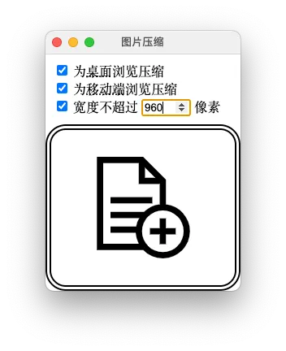
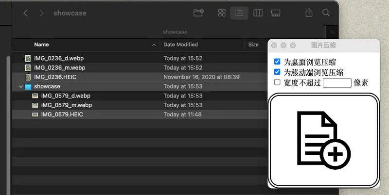

# ImageResizer



为我常用的图片尺寸调整指令做一层 UI 封装。

如果你熟悉 ImageMagick 等工具，那给图片调整下适合的尺寸好在论坛上传什么的这都不是事儿，很遗憾，我不是，所以我写了这个小工具。

## 如何使用

ImageResizer 只做一件事，接收图片或者包含图片的文件夹，缩放到宽度为指定像素大小，然后在同一目录下输出 webp 格式的图片。

-   提供了桌面模式（宽度 800px），输出带 `_d` 后缀的文件
-   提供了移动端模式（宽度 320px），输出带 `_m` 后缀的文件
-   提供了自定义模式（宽度手工指定），输出带 `_c` 后缀的文件



### 注意事项

ImageResizer 由 [lovell/sharp](https://github.com/lovell/sharp/) 直接支持 `jpeg`，`png`，`webp`，`avif`，`tiff`，`gif`，`svg` 格式。

由于 HEVC 编码器受专利保护，要使 sharp 支持 iPhone 导出的 HEIC 格式，需要全局安装 libvips，相关问题详见 [sharp 0.27.0 - heif: Unsupported feature: Unsupported codec #2518](https://github.com/lovell/sharp/issues/2518)
。因此 HEIC 图像改由 [heic-convert](https://github.com/catdad-experiments/heic-convert#readme) 转换为 JPEG 以提供支持，在处理速度上将有一定影响。

## 如何安装

安装依赖

```bash
yarn
```

打包（macOS）

```bash
yarn dist
```

成功后把 `dist/mac/image-resizer.app` 复制到 `$HOME/Applications` 即可。

macOS 有个签名的玩意，所以如果你打包后想要分发给别人，可以在目标机器上自己签名。

```bash
sudo xattr -rd com.apple.quarantine /Applications/"$app_bashname"
```

Macbook 是我目前除娱乐需求外的主力设备，因此还没有在 Windows 和 Linux 设备上测试过。
